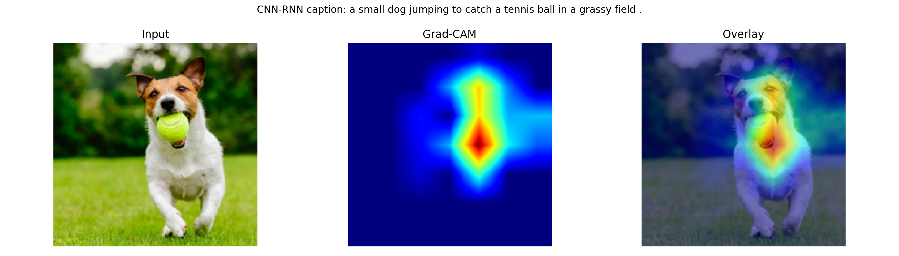
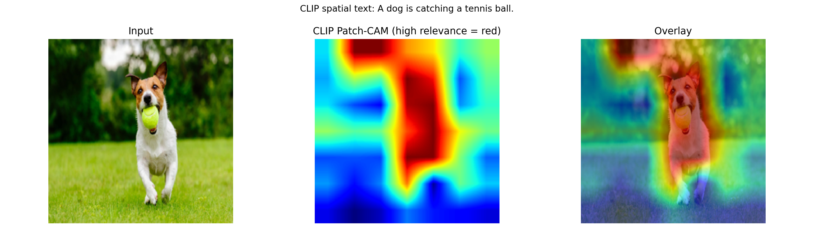
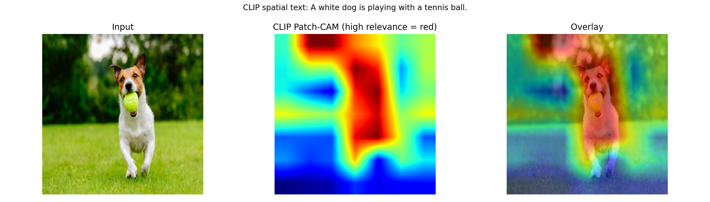
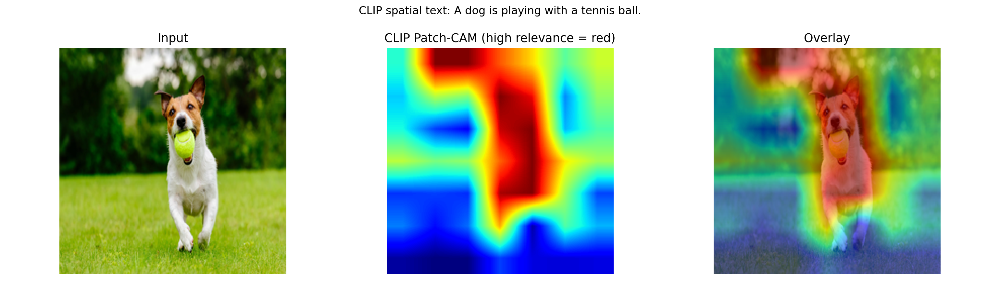

# ClipCap và CNN-RNN cho Image Captioning

Hệ thống này phục vụ bài toán sinh mô tả ảnh tự động với hai hướng tiếp cận chính:

- `ClipCap`: tận dụng biểu diễn ngữ nghĩa mạnh từ CLIP, sau đó ánh xạ sang không gian ngôn ngữ của GPT-2 để sinh caption.
- `CNN-RNN`: baseline encoder-decoder cổ điển với `ResNet-50` làm bộ mã hóa ảnh và `LSTM` làm bộ giải mã ngôn ngữ.

Mã nguồn đi kèm đầy đủ các thành phần cần thiết cho một quy trình thực nghiệm hoàn chỉnh:

- huấn luyện mô hình,
- Inferemce trên ảnh đơn,
- đánh giá bằng các metric captioning chuẩn,
- trực quan hóa vùng ảnh quan trọng bằng `Grad-CAM` và `CLIP Patch-CAM`,
- phân tích diễn tiến sinh token theo thời gian cho biến thể ClipCap dùng `transformer mapper`.

## Tổng quan phương pháp

### 1. ClipCap

ClipCap trong repo này tuân theo ý tưởng dùng đặc trưng ảnh từ CLIP như một `prefix` cho mô hình ngôn ngữ:

1. Ảnh được mã hóa bằng CLIP để thu được embedding toàn cục.
2. Embedding CLIP được đưa qua một mạng ánh xạ `clip_project`.
3. Chuỗi prefix embedding thu được được ghép trước embedding token của GPT-2.
4. GPT-2 sinh caption theo cơ chế tự hồi quy.

Repo hỗ trợ ba cấu hình ClipCap:

1. `MLP + GPT-2 frozen`
2. `Transformer mapper + GPT-2 frozen`
3. `Transformer mapper + GPT-2 fine-tuned`

### 2. CNN-RNN

CNN-RNN là baseline đối chứng nhằm so sánh với ClipCap:

1. Ảnh đi qua `ResNet-50` pretrained.
2. Feature ảnh được chiếu về không gian embedding.
3. Feature này khởi tạo trạng thái ẩn của `LSTM`.
4. `LSTM` sinh caption từng token.

### 3. Mục tiêu thực nghiệm

Thiết kế repo hướng đến ba mục tiêu:

- so sánh chất lượng caption giữa kiến trúc truyền thống và kiến trúc dùng CLIP,
- đánh giá tác động của `mapping_type`, `only_prefix` và fine-tuning GPT-2,
- cung cấp công cụ trực quan hóa để phân tích hành vi mô hình thay vì chỉ báo cáo metric.

## Kiến trúc mã nguồn

```text
clipcap/
├─ train.py
├─ train_cnn_rnn.py
├─ predict.py
├─ evaluate.py
├─ visualize_captioning.py
├─ visualize_transformer_token_focus.py
├─ run_visualize_transformer_token_focus.sh
├─ split_flickr30k_captions.py
├─ download.py
├─ FLICKR30K_TRAINING_GUIDE.md
├─ notebooks/
├─ Images/
└─ visualizations/
```

Các tệp chính:

- [train.py](/c:/Users/Asus/Desktop/clipcap/train.py): điểm vào chính cho huấn luyện `clipcap` và `cnn_rnn`.
- [train_cnn_rnn.py](/c:/Users/Asus/Desktop/clipcap/train_cnn_rnn.py): cài đặt chi tiết baseline CNN-RNN.
- [predict.py](/c:/Users/Asus/Desktop/clipcap/predict.py): sinh caption cho một ảnh.
- [evaluate.py](/c:/Users/Asus/Desktop/clipcap/evaluate.py): đánh giá trên tập dữ liệu với các metric captioning.
- [visualize_captioning.py](/c:/Users/Asus/Desktop/clipcap/visualize_captioning.py): trực quan hóa `Grad-CAM` hoặc `CLIP Patch-CAM`.
- [visualize_transformer_token_focus.py](/c:/Users/Asus/Desktop/clipcap/visualize_transformer_token_focus.py): phân tích focus theo từng bước sinh token.
- [split_flickr30k_captions.py](/c:/Users/Asus/Desktop/clipcap/split_flickr30k_captions.py): chia annotation Flickr30k thành train/val/test theo image-level.
- [download.py](/c:/Users/Asus/Desktop/clipcap/download.py): tải Flickr image dataset qua `kagglehub`.

## Cài đặt

### 1. Yêu cầu môi trường

- Python 3.9+ được khuyến nghị
- CUDA nếu muốn train/infer bằng GPU
- Java nếu cần dùng đầy đủ `METEOR` và `SPICE`

### 2. Cài đặt thư viện

```bash
pip install torch torchvision transformers pillow tqdm matplotlib scikit-image numpy
pip install pycocoevalcap pycocotools
pip install bert-score
pip install git+https://github.com/openai/CLIP.git
pip install kagglehub
```

Ghi chú:

- `CLIP` là bắt buộc cho toàn bộ pipeline `clipcap`.
- `torchvision` là bắt buộc cho `cnn_rnn`.
- `matplotlib` là bắt buộc cho các script visualize.
- `bert-score` là tùy chọn; nếu thiếu, `evaluate.py` vẫn chạy và bỏ qua BERTScore.

## Dữ liệu

### 1. Dữ liệu cho CNN-RNN

Baseline CNN-RNN làm việc trực tiếp với ảnh và caption thô.

Hai định dạng annotation được hỗ trợ:

1. Token file:
   - `image_name#idx<TAB>caption`
   - hoặc `image_name|idx|caption`
2. Karpathy JSON:
   - dùng với `--karpathy_json`
   - hỗ trợ `--split train|val|test|all`

Cấu trúc thư mục điển hình:

```text
data/flickr30k/
├─ flickr30k-images/
│  ├─ xxx.jpg
│  └─ ...
├─ results_20130124.token
└─ dataset_flickr30k.json
```

### 2. Dữ liệu cho ClipCap

Khác với CNN-RNN, ClipCap trong repo này train trên file `.pkl` đã được tiền xử lý sẵn, gồm:

- `clip_embedding`
- `captions`

Mỗi phần tử trong `captions` cần có tối thiểu:

- `caption`
- `image_id`
- `clip_embedding`

Lưu ý quan trọng:

- repo hiện tham chiếu tới các script như `parse_flickr30k.py`, `parse_coco.py`, `parse_conceptual.py`,
- nhưng các script đó không có mặt trong mã nguồn hiện tại.

Điều đó có nghĩa:

- để chạy ClipCap, bạn cần file `.pkl` đã chuẩn bị sẵn,
- hoặc tự bổ sung bước trích xuất CLIP embedding tương ứng.

### 3. Tải Flickr dataset

```bash
python download.py
```

Script sẽ:

- tải dataset `hsankesara/flickr-image-dataset` bằng `kagglehub`,
- sao chép dữ liệu từ cache về thư mục dự án.

### 4. Chia train/val/test cho Flickr30k

```bash
python split_flickr30k_captions.py \
  --captions_file ./data/flickr30k/results_20130124.token \
  --out_dir ./data/flickr30k \
  --train_ratio 0.8 \
  --val_ratio 0.1 \
  --test_ratio 0.1 \
  --seed 42
```

Kết quả:

- `results_train.csv`
- `results_val.csv`
- `results_test.csv`

Script chia theo `image id`, do đó các caption của cùng một ảnh sẽ không bị rơi vào nhiều tập khác nhau.

## Huấn luyện

## 1. Huấn luyện ClipCap

Lệnh cơ bản:

```bash
python train.py \
  --model_arch clipcap \
  --data ./data/flickr30k/flickr30k_clip_ViT-B_32_train.pkl \
  --out_dir ./checkpoints/flickr30k_mlp \
  --prefix flickr30k_mlp
```

### Các cấu hình ClipCap

#### a. MLP mapper, chỉ train prefix

```bash
python train.py \
  --model_arch clipcap \
  --data ./data/flickr30k/flickr30k_clip_ViT-B_32_train.pkl \
  --out_dir ./checkpoints/flickr30k_mlp \
  --prefix flickr30k_mlp \
  --mapping_type mlp \
  --only_prefix
```

#### b. Transformer mapper, GPT-2 frozen

```bash
python train.py \
  --model_arch clipcap \
  --data ./data/flickr30k/flickr30k_clip_ViT-B_32_train.pkl \
  --out_dir ./checkpoints/flickr30k_transformer_frozen \
  --prefix flickr30k_transformer_frozen \
  --mapping_type transformer \
  --only_prefix \
  --prefix_length 10 \
  --prefix_length_clip 10 \
  --num_layers 8
```

#### c. Transformer mapper, fine-tune GPT-2

```bash
python train.py \
  --model_arch clipcap \
  --data ./data/flickr30k/flickr30k_clip_ViT-B_32_train.pkl \
  --out_dir ./checkpoints/flickr30k_transformer_finetune \
  --prefix flickr30k_transformer_finetune \
  --mapping_type transformer \
  --prefix_length 10 \
  --prefix_length_clip 10 \
  --num_layers 8
```

### Tham số chính của ClipCap

| Tham số | Ý nghĩa |
|---|---|
| `--data` | Đường dẫn tới file `.pkl` chứa CLIP embedding và caption |
| `--out_dir` | Thư mục lưu checkpoint |
| `--prefix` | Tiền tố tên checkpoint |
| `--epochs` | Số epoch, mặc định `10` |
| `--save_every` | Chu kỳ lưu checkpoint |
| `--bs` | Batch size, mặc định `40` |
| `--prefix_length` | Số token prefix đưa vào GPT-2 |
| `--prefix_length_clip` | Số token dùng trong transformer mapper |
| `--mapping_type` | `mlp` hoặc `transformer` |
| `--num_layers` | Số layer của transformer mapper |
| `--only_prefix` | Chỉ train mapper, freeze GPT-2 |
| `--normalize_prefix` | Chuẩn hóa vector CLIP trước khi đưa vào mapper |
| `--is_rn` | Dùng embedding CLIP chiều `640` thay vì `512` |

### Đầu ra của ClipCap

Checkpoint được lưu theo mẫu:

- `PREFIX-000.pt`
- `PREFIX-001.pt`
- ...

Ví dụ:

- `flickr30k_transformer_finetune-009.pt`

## 2. Huấn luyện CNN-RNN

### Cách 1. Gọi trực tiếp `train_cnn_rnn.py`

```bash
python train_cnn_rnn.py \
  --images_dir ./data/flickr30k/flickr30k-images \
  --captions_file ./data/flickr30k/results_20130124.token \
  --out_dir ./checkpoints/cnn_rnn \
  --prefix flickr30k_cnn_rnn
```

### Cách 2. Dùng `train.py`

```bash
python train.py \
  --model_arch cnn_rnn \
  --images_dir ./data/flickr30k/flickr30k-images \
  --captions_file ./data/flickr30k/results_20130124.token \
  --out_dir ./checkpoints/cnn_rnn \
  --prefix flickr30k_cnn_rnn \
  --epochs 15 \
  --batch_size 64
```

### Train theo Karpathy split

```bash
python train.py \
  --model_arch cnn_rnn \
  --images_dir ./data/flickr30k/flickr30k-images \
  --karpathy_json ./data/flickr30k/dataset_flickr30k.json \
  --split train \
  --out_dir ./checkpoints/cnn_rnn \
  --prefix flickr30k_cnn_rnn
```

### Tham số chính của CNN-RNN

| Tham số | Ý nghĩa |
|---|---|
| `--images_dir` | Thư mục ảnh |
| `--captions_file` | File caption thô |
| `--karpathy_json` | Annotation dạng Karpathy |
| `--split` | `train`, `val`, `test` hoặc `all` |
| `--epochs` | Số epoch, mặc định `15` |
| `--batch_size` | Batch size, mặc định `64` |
| `--lr` | Learning rate |
| `--weight_decay` | Hệ số weight decay |
| `--num_workers` | Số worker cho DataLoader |
| `--embed_size` | Kích thước embedding |
| `--hidden_size` | Hidden size của LSTM |
| `--rnn_layers` | Số lớp LSTM |
| `--dropout` | Dropout của decoder |
| `--max_tokens` | Độ dài caption tối đa khi train |
| `--min_word_freq` | Tần suất tối thiểu để giữ từ trong vocab |
| `--unfreeze_cnn` | Fine-tune ResNet backbone |

### Đầu ra của CNN-RNN

Mỗi checkpoint lưu:

- trọng số mô hình,
- optimizer state,
- epoch,
- average loss,
- vocabulary,
- cấu hình chạy.

Ngoài checkpoint `.pt`, repo còn lưu thêm:

- `PREFIX_config.json`

## Inferemce

## 1. Inferemce với ClipCap

### Beam search

```bash
python predict.py \
  --model_arch clipcap \
  --image ./Images/img.jpg \
  --checkpoint ./checkpoints/flickr30k_transformer_finetune/flickr30k_transformer_finetune-009.pt \
  --mapping_type transformer \
  --prefix_length 10 \
  --prefix_length_clip 10 \
  --num_layers 8 \
  --decode beam \
  --beam_size 5
```

### Nucleus decoding

```bash
python predict.py \
  --model_arch clipcap \
  --image ./Images/img.jpg \
  --checkpoint ./checkpoints/flickr30k_mlp/flickr30k_mlp-009.pt \
  --mapping_type mlp \
  --only_prefix \
  --decode nucleus \
  --top_p 0.8
```

Các tham số decode quan trọng:

- `--decode`: `beam` hoặc `nucleus`
- `--beam_size`
- `--top_p`
- `--temperature`
- `--entry_length`
- `--clip_model_type`

## 2. Inferemce với CNN-RNN

```bash
python predict.py \
  --model_arch cnn_rnn \
  --image ./Images/img.jpg \
  --checkpoint ./checkpoints/cnn_rnn/flickr30k_cnn_rnn-014.pt
```

Tham số thường dùng:

- `--cnn_max_len`
- `--temperature`
- `--embed_size`
- `--hidden_size`
- `--rnn_layers`
- `--dropout`

Nếu không truyền các tham số kiến trúc, script sẽ cố gắng đọc lại từ checkpoint.

## Đánh giá

Script đánh giá:

- [evaluate.py](/c:/Users/Asus/Desktop/clipcap/evaluate.py)

Các metric được hỗ trợ:

- `Bleu_1`
- `Bleu_2`
- `Bleu_3`
- `Bleu_4`
- `METEOR`
- `ROUGE_L`
- `CIDEr`
- `SPICE`
- `BERTScore_P`
- `BERTScore_R`
- `BERTScore_F1`

## 1. Đánh giá ClipCap

```bash
python evaluate.py \
  --model_arch clipcap \
  --data ./data/flickr30k/flickr30k_clip_ViT-B_32_test.pkl \
  --checkpoint ./checkpoints/flickr30k_transformer_finetune/flickr30k_transformer_finetune-009.pt \
  --mapping_type transformer \
  --prefix_length 10 \
  --prefix_length_clip 10 \
  --num_layers 8 \
  --decode beam \
  --beam_size 5 \
  --save_predictions ./checkpoints/flickr30k_transformer_finetune/eval_results.json
```

## 2. Đánh giá CNN-RNN

```bash
python evaluate.py \
  --model_arch cnn_rnn \
  --images_dir ./data/flickr30k/flickr30k-images \
  --karpathy_json ./data/flickr30k/dataset_flickr30k.json \
  --split test \
  --checkpoint ./checkpoints/cnn_rnn/flickr30k_cnn_rnn-014.pt \
  --save_predictions ./checkpoints/cnn_rnn/eval_results.json
```

Tùy chọn hữu ích:

- `--max_samples N`: chạy nhanh trên tập con
- `--save_predictions`: lưu `metrics`, `predictions`, `references` và `config` ra JSON

Lưu ý:

- repo hiện không đi kèm sẵn file `eval_results.json`,
- vì vậy phần kết quả định lượng cần được sinh lại bằng `evaluate.py`.

## Trực quan hóa

## 1. Trực quan hóa tổng quát với `visualize_captioning.py`

Script hỗ trợ hai chế độ:

1. `cnn_rnn`: sinh `Grad-CAM`
2. `clipcap`: sinh `CLIP Patch-CAM`

Các file đầu ra trong `--out_dir`:

- `*_summary.json`
- `*_gradcam.png`
- `*_clip_patch_cam.png`
- `*_input.png`

### CNN-RNN

```bash
python visualize_captioning.py \
  --model_arch cnn_rnn \
  --image ./Images/img.jpg \
  --checkpoint ./checkpoints/cnn_rnn/flickr30k_cnn_rnn-014.pt \
  --out_dir ./visualizations \
  --output_prefix cnn_rnn
```

### ClipCap MLP

```bash
python visualize_captioning.py \
  --model_arch clipcap \
  --image ./Images/img.jpg \
  --checkpoint ./checkpoints/flickr30k_mlp/flickr30k_mlp-009.pt \
  --mapping_type mlp \
  --only_prefix \
  --prefix_length 10 \
  --out_dir ./visualizations \
  --output_prefix clip_mlp
```

### ClipCap Transformer frozen

```bash
python visualize_captioning.py \
  --model_arch clipcap \
  --image ./Images/img.jpg \
  --checkpoint ./checkpoints/flickr30k_transformer_frozen/flickr30k_transformer_frozen-009.pt \
  --mapping_type transformer \
  --only_prefix \
  --prefix_length 10 \
  --prefix_length_clip 10 \
  --num_layers 8 \
  --out_dir ./visualizations \
  --output_prefix clip_transformer_frozen
```

### ClipCap Transformer fine-tune

```bash
python visualize_captioning.py \
  --model_arch clipcap \
  --image ./Images/img.jpg \
  --checkpoint ./checkpoints/flickr30k_transformer_finetune/flickr30k_transformer_finetune-009.pt \
  --mapping_type transformer \
  --prefix_length 10 \
  --prefix_length_clip 10 \
  --num_layers 8 \
  --out_dir ./visualizations \
  --output_prefix clip_transformer_finetune
```

Diễn giải:

- `Grad-CAM` phản ánh vùng ảnh mà CNN-RNN sử dụng mạnh để sinh caption.
- `CLIP Patch-CAM` là phép xấp xỉ không gian dựa trên gradient của CLIP theo văn bản mục tiêu.
- Với ClipCap, đây là công cụ giải thích gián tiếp chứ không phải attention map nội tại của GPT-2.

## 2. Phân tích token-by-token với `visualize_transformer_token_focus.py`

Script này dành cho checkpoint ClipCap, đặc biệt là cấu hình `transformer mapper`.

```bash
python visualize_transformer_token_focus.py \
  --image ./Images/img.jpg \
  --checkpoint ./checkpoints/flickr30k_transformer_finetune/flickr30k_transformer_finetune-009.pt \
  --mapping_type transformer \
  --prefix_length 10 \
  --prefix_length_clip 10 \
  --num_layers 8 \
  --clip_model_type ViT-B/32 \
  --max_steps 20 \
  --out_dir ./visualizations/token_focus \
  --output_prefix transformer_token_focus
```

Hoặc dùng script mẫu:

- [run_visualize_transformer_token_focus.sh](/c:/Users/Asus/Desktop/clipcap/run_visualize_transformer_token_focus.sh)

Đầu ra điển hình:

```text
visualizations/token_focus/transformer_token_focus/
├─ step_001_xxx.png
├─ step_002_xxx.png
├─ ...
├─ timeline.png
└─ summary.json
```

Ý nghĩa:

- `step_XXX_*.png`: heatmap tại từng bước sinh token
- `timeline.png`: tổng hợp các bước quan trọng
- `summary.json`: lưu token id, token text, caption từng bước và đường dẫn ảnh

Ghi chú phương pháp:

- spatial map trong script này là `CLIP Patch-CAM proxy conditioned on generated text so far`,
- không phải attention map nội tại của transformer mapper hoặc GPT-2.

## Kết quả trực quan hóa hiện có

Thư mục [visualizations](/c:/Users/Asus/Desktop/clipcap/visualizations) hiện chứa bốn ví dụ minh họa cho cùng một ảnh.

<table>
  <tr>
    <th>Ảnh gốc</th>
    <th>Mô hình</th>
    <th>Caption</th>
    <th>Kết quả trực quan hóa</th>
  </tr>
  <tr>
    <td></td>
    <td><code>CNN-RNN</code></td>
    <td><code>a small dog jumping to catch a tennis ball in a grassy field .</code></td>
    <td></td>
  </tr>
  <tr>
    <td></td>
    <td><code>ClipCap MLP</code></td>
    <td><code>A dog is catching a tennis ball.</code></td>
    <td></td>
  </tr>
  <tr>
    <td></td>
    <td><code>ClipCap Transformer frozen</code></td>
    <td><code>A white dog is playing with a tennis ball.</code></td>
    <td></td>
  </tr>
  <tr>
    <td></td>
    <td><code>ClipCap Transformer fine-tune</code></td>
    <td><code>A dog is playing with a tennis ball.</code></td>
    <td></td>
  </tr>
</table>
Patch-CAM là phép giải thích gián tiếp

Patch-CAM của ClipCap rất hữu ích cho phân tích định tính, nhưng không nên xem là attention ground-truth của mô hình.


## Cấu hình tham số theo từng script

### 1. `train.py`

Nhóm ClipCap:

- `--model_arch`
- `--data`
- `--out_dir`
- `--prefix`
- `--epochs`
- `--save_every`
- `--prefix_length`
- `--prefix_length_clip`
- `--bs`
- `--only_prefix`
- `--mapping_type`
- `--num_layers`
- `--is_rn`
- `--normalize_prefix`
- `--device`

Nhóm CNN-RNN:

- `--images_dir`
- `--captions_file`
- `--karpathy_json`
- `--split`
- `--batch_size`
- `--lr`
- `--weight_decay`
- `--num_workers`
- `--embed_size`
- `--hidden_size`
- `--rnn_layers`
- `--dropout`
- `--max_tokens`
- `--min_word_freq`
- `--unfreeze_cnn`
- `--seed`
- `--device`

### 2. `predict.py`

- `--model_arch`
- `--image`
- `--checkpoint`
- `--device`
- `--mapping_type`
- `--only_prefix`
- `--prefix_length`
- `--prefix_length_clip`
- `--num_layers`
- `--is_rn`
- `--normalize_prefix`
- `--decode`
- `--beam_size`
- `--top_p`
- `--temperature`
- `--entry_length`
- `--clip_model_type`
- `--cnn_max_len`
- `--embed_size`
- `--hidden_size`
- `--rnn_layers`
- `--dropout`

### 3. `evaluate.py`

- `--model_arch`
- `--data`
- `--checkpoint`
- `--mapping_type`
- `--only_prefix`
- `--prefix_length`
- `--prefix_length_clip`
- `--num_layers`
- `--is_rn`
- `--normalize_prefix`
- `--device`
- `--decode`
- `--beam_size`
- `--top_p`
- `--temperature`
- `--entry_length`
- `--max_samples`
- `--save_predictions`
- `--images_dir`
- `--captions_file`
- `--karpathy_json`
- `--split`
- `--cnn_max_len`
- `--embed_size`
- `--hidden_size`
- `--rnn_layers`
- `--dropout`


## Chạy Thực nghiệm

### 1. Với CNN-RNN

1. Chuẩn bị ảnh và annotation Flickr30k.
2. Train:

```bash
python train.py \
  --model_arch cnn_rnn \
  --images_dir ./data/flickr30k/flickr30k-images \
  --karpathy_json ./data/flickr30k/dataset_flickr30k.json \
  --split train \
  --out_dir ./checkpoints/cnn_rnn \
  --prefix flickr30k_cnn_rnn
```

3. Predict:

```bash
python predict.py \
  --model_arch cnn_rnn \
  --image ./Images/img.jpg \
  --checkpoint ./checkpoints/cnn_rnn/flickr30k_cnn_rnn-014.pt
```

4. Evaluate:

```bash
python evaluate.py \
  --model_arch cnn_rnn \
  --images_dir ./data/flickr30k/flickr30k-images \
  --karpathy_json ./data/flickr30k/dataset_flickr30k.json \
  --split test \
  --checkpoint ./checkpoints/cnn_rnn/flickr30k_cnn_rnn-014.pt
```

5. Visualize:

```bash
python visualize_captioning.py \
  --model_arch cnn_rnn \
  --image ./Images/img.jpg \
  --checkpoint ./checkpoints/cnn_rnn/flickr30k_cnn_rnn-014.pt \
  --out_dir ./visualizations \
  --output_prefix cnn_rnn
```

### 2. Với ClipCap

1. Chuẩn bị file `.pkl` chứa CLIP embedding.
2. Train:

```bash
python train.py \
  --model_arch clipcap \
  --data ./data/flickr30k/flickr30k_clip_ViT-B_32_train.pkl \
  --out_dir ./checkpoints/flickr30k_transformer_finetune \
  --prefix flickr30k_transformer_finetune \
  --mapping_type transformer
```

3. Predict:

```bash
python predict.py \
  --model_arch clipcap \
  --image ./Images/img.jpg \
  --checkpoint ./checkpoints/flickr30k_transformer_finetune/flickr30k_transformer_finetune-009.pt \
  --mapping_type transformer \
  --prefix_length 10 \
  --prefix_length_clip 10 \
  --num_layers 8
```

4. Evaluate:

```bash
python evaluate.py \
  --model_arch clipcap \
  --data ./data/flickr30k/flickr30k_clip_ViT-B_32_test.pkl \
  --checkpoint ./checkpoints/flickr30k_transformer_finetune/flickr30k_transformer_finetune-009.pt \
  --mapping_type transformer \
  --prefix_length 10 \
  --prefix_length_clip 10 \
  --num_layers 8
```

5. Visualize:

```bash
python visualize_captioning.py \
  --model_arch clipcap \
  --image ./Images/img.jpg \
  --checkpoint ./checkpoints/flickr30k_transformer_finetune/flickr30k_transformer_finetune-009.pt \
  --mapping_type transformer \
  --prefix_length 10 \
  --prefix_length_clip 10 \
  --num_layers 8 \
  --out_dir ./visualizations \
  --output_prefix clip_transformer_finetune
```

6. Token focus:

```bash
python visualize_transformer_token_focus.py \
  --image ./Images/img.jpg \
  --checkpoint ./checkpoints/flickr30k_transformer_finetune/flickr30k_transformer_finetune-009.pt \
  --mapping_type transformer \
  --prefix_length 10 \
  --prefix_length_clip 10 \
  --num_layers 8 \
  --out_dir ./visualizations/token_focus \
  --output_prefix transformer_token_focus
```

